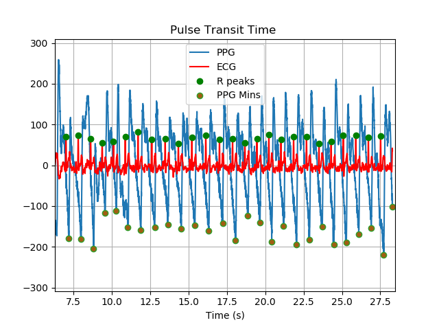
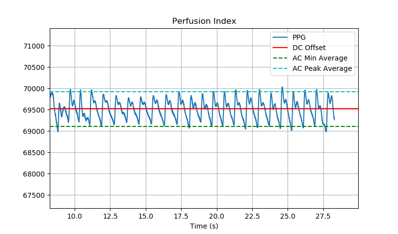
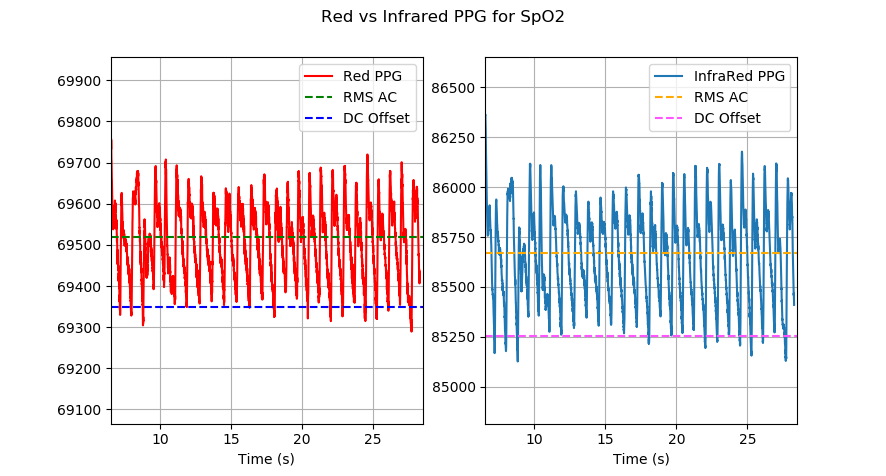

ppg\_features package
===============================

Submodules
----------

ppg\_features.ppg\_features module
------------------------------------------------------

.. automodule:: ppg_features.ppg_features
    :members:
    :undoc-members:
    :show-inheritance:
	
*Visual of Pulse Transit Time:*

We take the average time deltas between R peaks and ppg Mins.

*Visual of Perfusion Index Calculation:*

We calculate PI = ((AC Peak Average - AC Min Average)/DC Offset) * 100%

*Visual of SpO2 Calculation:*

Sp02 has a linear relationship with the ratio: r = ((AC rms of Red/ DC of Red)/(AC rms of InfraRed/DC of InfraRed))

*Example of use:*

.. code-block:: python
	
	ppg_red = data['ppg_red']
	ppg_infrared = data['ppg_infrared']
	ecg = data['ecg']
	bpm = bpm(ppg_infrared)
	spo2 = spo2(ppg_red, ppg_infrared)
	perfusion_index = perfusion_index(ppg_infrared)
	pulse_transit_time = pulse_transit_time(ecg, ppg_red)
	

